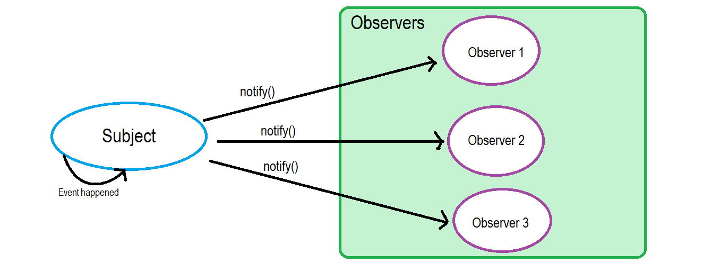

# 发布订阅与观察者

## 引入

发布订阅模式常见于软件开发中，更常见于日常生活中。从名称来看，“发布订阅模式”似乎是设计模式的一种，但是在常规的设计模式中，并没有发布订阅这一种模式。相反，可以看到一个叫做“观察者模式”的设计模式。

观察者模式和发布订阅模式非常相似，但这并不意味这两者是同一个东西。

用生活中的例子来说明，以同学老王结婚这一背景。观察者模式就好像：同班同学告诉老王，结婚时记得叫我们去喝喜酒！于是老王把所有说过这些话的同学的名字记下来，在他定了婚礼的时候，按照名单一个个通知当年的同学。

而发布订阅模式则不太一样：老王同学定了婚礼，然后在微博发布了这个消息————欢迎同学们来参加我的婚礼。老王发完微博，就继续忙自己的事去了。同学们通过关注老王的微博，看到老王的微博来得知这一消息。

这就是观察者模式和发布订阅模式的区别，这两个模式中最大的区别就是参与方的数量不一样。

在观察者模式中，参与者一共有两个：subject（老王结婚）和observer（同学们）。subject和observer是观察者模式中的常用词，代表主题和观察者。观察者观察主题，主题通知观察者。



在观察者模式中，参与者一共有三个：publisher（老王），broker（微博）和observer（同学们）。subject，broker和observer是发布订阅模式中的常用词，代表发布者，消息通道（消息代理）和订阅者。发布者发布消息到消息通道，订阅者从消息通道订阅消息。


由于两者设计上的不同，导致了两者的不同点
1. 观察者模式中的主题和观察者耦合，主题维护了所有观察者。而发布订阅模式相反。
2. 观察者模式中主题可以确保观察者接收到消息，而发布订阅模式中发布者无法知道订阅者是否成功收到消息。
3. 观察者模式相对不灵活，一次维护一个主题。而发布订阅模式中，发布者和订阅者通过事件名对应，增加主题只要增加一种事件名。

可以用下面这一张图描述两者的区别：


## 实现

从上面的论述中可以看到，发布订阅模式是一种更加复杂的观察者模式。那么先从简单的开始，写一个乞丐版的观察者模式的实现：

``` js
class Subject {
    observers = []

    add(ob) {
        this.observers.push(ob)
    }

    notify(...args) {
        this.observers.forEach((ob) => ob.update(...args))
    }
}

class Observer {
    update(...args) {
        console.log(...args);
    }
}

const classmate1 = new Observer()
const classmate2 = new Observer()

const weddingSubject = new Subject()

weddingSubject.add(classmate1)
weddingSubject.add(classmate2)

weddingSubject.notify('My wedding will be held tomorrow at xx hotel')
```

以上代码将会输出：
``` bash
My wedding will be held tomorrow at xx hotel
My wedding will be held tomorrow at xx hotel
```

接下来是发布订阅模式的实现：
``` js
class EventCenter {
  events = {};

  register(eventName, cb, once = false) {
    if (this.events[eventName] === undefined) {
      this.events[eventName] = [{ cb, once }];
    } else {
      this.events[eventName].push({ cb, once });
    }
  }

  fire(eventName, ...args) {
    if (this.events[eventName] === undefined) return;
    this.events[eventName].forEach((handler) => {
      if (handler.once && handler.fired) return;
      handler.cb.apply(this, args);
      handler.fired = true;
    });
  }

  registerOnce(eventName, cb) {
    this.register(eventName, cb, true);
  }

  unRegister(eventName, cb) {
    if (this.events[eventName] === undefined) return;
    const targetIndex = this.events[eventName].findIndex((i) => i.cb === cb);
    if (targetIndex === -1) return;

    if (this.events[eventName].length === 1) {
      delete this.events[eventName];
      return;
    }
    this.events[eventName].splice(targetIndex, 1);
  }
}

const ec = new EventCenter();

const cb1 = (msg, more) => console.log(1, msg, more);
const cb2 = (msg) => console.log(2, msg);
const cb3 = (msg) => console.log(3, msg);

ec.registerOnce("some-event", cb1);
ec.register("some-event", cb2);
ec.register("some-event", cb3);

ec.fire("some-event", "hello event", "some more params");

ec.unRegister("some-event", cb3);

ec.fire("some-event", "hello event");

```

这里定义了EventCenter类，也就是消息通道。发布者通过消息通道的fire方法发布事件，订阅者通过消息通道的register方法注册事件。

fire和register通过同样的事件名称关联。EventCenter实例维护了订阅者的列表，使得发布者无需关心订阅者，实现两者的解耦。

其实基本的实现只需要fire和register两个方法就够了。为了这个类不那么鸡肋，也因为参考了vue中的事件和nodejs的EventEmitter类，添加了registerOnce和unRegister两个方法。registerOnce代表注册事件只在发布者首次发布时响应（可能因为有些人不想参加同学二婚），unRegister方法用来移除已添加的订阅事件。

分析上述代码，在第一次发布事件的时候，有三个订阅者响应。在第二次发布事件的时候，cb1由于是通过registerOnce注册，后续事件不再响应。cb3被unRegister移除。就只剩下cb2会响应第二次事件的发布。

那么运行上述代码的结果就是：
```bash
1 hello event some more params
2 hello event
3 hello event
2 hello event
```

## 实例

现在来看看Nodejs的EventEmitter是怎么实现发布订阅的吧

代码在 https://github.com/nodejs/node/blob/master/lib/events.js

首先看一下EventEmitter的基本用法，如下：
``` js
const EventEmitter = require('events');

const myEmitter = new EventEmitter();

myEmitter.on('event', () => {
  console.log('an event occurred!');
});

myEmitter.emit('event');
```
可以看到使用方法和我们自己实现的很相似，EventEmitter通过on方法注册事件，通过emit方法发布事件。

接下来以这个最基本的demo去源码中查看实现。

``` js
function EventEmitter(opts) {
  EventEmitter.init.call(this, opts);
}
module.exports = EventEmitter;
```

在 *new EventEmitter()* 时，调用了init方法：
```js
EventEmitter.init = function(opts) {

  if (this._events === undefined ||
      this._events === ObjectGetPrototypeOf(this)._events) {
    this._events = ObjectCreate(null);
    this._eventsCount = 0;
  }

  this._maxListeners = this._maxListeners || undefined;

  // ...
}
```
这里做了一些初始化的工作，接下来调用on方法，实际上调用了addListener, 最终调用了_addListener。
```js
EventEmitter.prototype.addListener = function addListener(type, listener) {
  return _addListener(this, type, listener, false);
};

EventEmitter.prototype.on = EventEmitter.prototype.addListener;
```

接下来查看_addListener方法，看第一次调用时的简化逻辑
```js
function _addListener(target, type, listener, prepend) {
  let m;
  let events;
  let existing;

  checkListener(listener);

  events = target._events;
  if (events === undefined) {
    events = target._events = ObjectCreate(null);
    target._eventsCount = 0;
  } else {
      // ...
  }

  if (existing === undefined) {
    // Optimize the case of one listener. Don't need the extra array object.
    events[type] = listener;
    ++target._eventsCount;
  } else {
    if (typeof existing === 'function') {
      // Adding the second element, need to change to array.
      existing = events[type] =
        prepend ? [listener, existing] : [existing, listener];
      // If we've already got an array, just append.
    } else if (prepend) {
      existing.unshift(listener);
    } else {
      existing.push(listener);
    }
    // ...
  }

  return target;
}
```

也就是说，在执行on方法后，就在实例上的_events上增加一个名为事件名的属性，这里nodejs对于单个订阅者和多个订阅者做了区分优化。

在EventEmitter中，_events就是用来维护所有订阅者的对象。在这个例子中，实例的结构就类似
```js
myEvent = {
    // ...
    _events: {
        event: fn
    }
    // ...
}
```

接下来调用emit方法发布事件：
```js
EventEmitter.prototype.emit = function emit(type, ...args) {
  // ...

  const events = this._events;

  // ...

  const handler = events[type];

  if (handler === undefined)
    return false;

  if (typeof handler === 'function') {
    const result = ReflectApply(handler, this, args);

    // We check if result is undefined first because that
    // is the most common case so we do not pay any perf
    // penalty
    if (result !== undefined && result !== null) {
      addCatch(this, result, type, args);
    }
  } else {
    const len = handler.length;
    const listeners = arrayClone(handler);
    for (let i = 0; i < len; ++i) {
      const result = ReflectApply(listeners[i], this, args);

      // We check if result is undefined first because that
      // is the most common case so we do not pay any perf
      // penalty.
      // This code is duplicated because extracting it away
      // would make it non-inlineable.
      if (result !== undefined && result !== null) {
        addCatch(this, result, type, args);
      }
    }
  }

  return true;
};

```

这里通过同样的事件名称找到on方法存储在实例上的回调函数，然后执行所有该事件对应的回调函数。

这样，一个简单的事件发布订阅流程就完成了，简单来看很像我们之前写的类，但是EventEmitter还做了很多优化和错误处理。还有更多的方法对回调做更精细的控制，如setMaxListeners，prependListener，once，prependOnceListener，removeListener，off，removeAllListeners等，这里就不一一展开了。

接下来看一下webpack封装的tapable库，同样，先看基本的使用方法

```js
const { SyncHook } = require('tapable')

const wedding = new SyncHook(['msg'])

wedding.tap('classmate1', (msg) => {
    console.log(`classmate1 received that ${msg}`);
})

wedding.tap('classmate2', (msg) => {
    console.log(`classmate2 received that ${msg}`);
})

wedding.call('the wedding will be held tomorrow')
```

从tapable的使用方式可以看到，这个库的形式属于观察者模式而非发布订阅模式。

以上demo的输出为：
```bash
classmate1 received that the wedding will be held tomorrow
classmate2 received that the wedding will be held tomorrow
```

这只是一个基本的用法，并不足以让webpack团队为此单独抽一个包，也不足以支持webpack的灵活的插件调度功能。tapable将观察者模式中的subject分为不同类型hook，tapable支持的hooks如下：

```js
const {
	SyncHook,
	SyncBailHook,
	SyncWaterfallHook,
	SyncLoopHook,
	AsyncParallelHook,
	AsyncParallelBailHook,
	AsyncSeriesHook,
	AsyncSeriesBailHook,
	AsyncSeriesWaterfallHook
 } = require("tapable");
```

从命名上可以看到，hooks分为同步和异步，异步又分为并行（parallel）和顺序执行（series）两类。

hooks根据执行逻辑又分为：
1. 常规（无尾缀，依次执行）
2. Bail（运行到某一个hook有返回值则退出）
3. Waterfall（前一个hook的返回作为下一个hook的参数）
4. Loop（当一个hook的返回值不是undefined时则回到第一个hook重新运行，直到所有hook都返回undefined为止）

这样不同类型的组合，形成了tapable的多样的hook。而我们之前所描述的观察者模式和发布订阅模式的实现，只是tapable中最基本的hook类型。那么接下来就来看看tapable的实现吧。

源码: https://github.com/webpack/tapable

先以简单的SyncHook为例，入口在lib/SyncHook.js

```js
const wedding = new SyncHook(['msg'])
```

SyncHook继承了Hook类，new SyncHook时实例化了一个Hook，并将传入的参数存在实例的_args中，并初始化了一些关键的属性如下：

```js
hook: {
    taps: Array<options>,
    tap: Function,
    call: Function,
    compile: Function,
    _x: Array<callback: Function>
}
```

tap和call之前已经在例子中看到了，分别是添加回调和触发事件的方法。taps用来存放所有的回调对象，_x用来存放所有的回调函数，compile用来生成运行时的代码。这些属性后面都会遇到，这里先提及一下。

接下来调用tap方法：
```js
wedding.tap('classmate1', (msg) => {
    console.log(`classmate1 received that ${msg}`);
})
```

在Hooks.js中，最后调用到_tap方法

```js
	_tap(type, options, fn) {
		if (typeof options === "string") {
			options = {
				name: options.trim()
			};
		}
    // ...
		options = Object.assign({ type, fn }, options);
		options = this._runRegisterInterceptors(options);
		this._insert(options);
	}
```

_tap方法传入的options就是在调用tap时传入的第一个参数'classmate1'，_tap将其转换为一个对象并传入_insert方法，此时的options为
```js
{
  fn:(msg) => {\n    console.log(`classMate1 received ${msg}`);\n},
  name:'classmate1',
  type:'sync',
}
```
此时_insert方法中前面部分的逻辑都不符合条件，只执行了最后一行
```js
this.taps[i] = item;
```

所以调用tap方法，本质上是将一个个如上形式的对象保存到实例的taps数组上。接下来就是调用call方法触发事件了。

call方法和tap方法一样，也存在于Hook类上。初始化为CALL_DELEGATE方法。CALL_DELEGATE方法调用_createCall方法，在_createCall中调用compile方法。compile是一个抽象方法，在SyncHook.js中被实现。

在SyncHook.js中可以看到compile实际上是创建了一个SyncHookCodeFactory实例并且调用了他的create方法。而SyncHookCodeFactory是继承HookCodeFactory的。从类名可以看出，这实际上做的是生成代码的工作。这也是tapable和普通的观察者模式或者发布订阅模式的很大的不同点。tapable并不直接执行回调，而是生成运行时代码。

一步一步看，首先创建了HookCodeFactory的实例，COMPILE方法调用了实例的setup方法。传递给setup的options参数为
```js
{
  args: ['msg'],
  interceptors: [],
  taps: [
    {type: 'sync', fn: ƒ, name: 'classMate1'},
    {type: 'sync', fn: ƒ, name: 'classMate2'},
  ],
  type:'sync'
}
```

setup方法在HookCodeFactory.js中定义，很简单，就是取出实例上的taps中的每一个回调函数放在实例的_x属性上。

然后调用create方法：
```js
	create(options) {
		this.init(options);
		let fn;
		switch (this.options.type) {
			case "sync":
				fn = new Function(
					this.args(),
					'"use strict";\n' +
						this.header() +
						this.contentWithInterceptors({
							onError: err => `throw ${err};\n`,
							onResult: result => `return ${result};\n`,
							resultReturns: true,
							onDone: () => "",
							rethrowIfPossible: true
						})
				);
				break;
      // ...
		}
		this.deinit();
		return fn;
	}
```

this.args()取出最开始存在实例上的_args作为运行时方法的形参

this.header()方法生成代码'var _context;\nvar _x = this._x;\n'

this.contentWithInterceptors()生成方法的执行内容，在这个方法中调用了this.content()方法。content在SyncHook.js中实现，实际上是调用了HookCodeFactory中的callTapsSeries方法。

callTapsSeries中的核心就是遍历hook实例上的taps数组并调用callTap方法生成代码
```js
	callTapsSeries({/*...*/}) {
    // ...
		for (let j = this.options.taps.length - 1; j >= 0; j--) {
			const i = j;

      // ...

			const content = this.callTap(i, {/*...*/});
			current = () => content;
		}
		code += current();
		return code;
	}
```
而callTap的关键是调用getTapFn方法
```js
callTap(tapIndex, {/*...*/}) {
  // ...
  code += `var _fn${tapIndex} = ${this.getTapFn(tapIndex)};\n`;
  // ...
  return code;
}

getTapFn(idx) {
  return `_x[${idx}]`;
}

```

getTapFn中的_x刚好对应header方法中的var _x = this._x，从而取出实例上的回调函数进行执行。

最后用生成的代码构造一个方法返回给我们调用。以上就是call方法执行的全过程。其他类型的hook执行流程也大抵如此。

所以tapable是一个进阶版的观察者模式，它通过compile生成的代码控制了回调函数的不同执行流程，来支撑webpack的灵活配置。